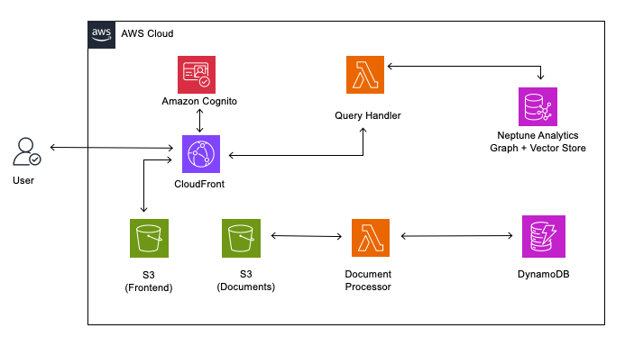

# GraphRAG Neptune Analytics Demo

A demo comparing **GraphRAG** (Knowledge Graph-enhanced RAG) with traditional **Vector-only RAG** side-by-side. Built on AWS using Neptune Analytics, Lambda, Cognito, and CloudFront.

## Why GraphRAG?

Traditional vector RAG finds content that is **semantically similar** to your question. But it misses information that is **structurally relevant but semantically dissimilar**.

Example scenario:
- Example Corp sells Widgets with huge Christmas demand in the UK
- Example Corp partners with AnyCompany Logistics for shipping
- AnyCompany Logistics uses the Turquoise Canal to cut shipping times
- The Turquoise Canal is blocked by landslides

When asked *"What are the sales prospects for Example Corp in the UK?"*, vector search returns optimistic results about demand and partnerships — but **misses** the supply chain disruption because "blocked canal" isn't semantically similar to "sales prospects."

GraphRAG solves this by building a **knowledge graph** of entities and relationships, then using **entity networks** (graph traversals) to find structurally connected information alongside vector similarity.

## Architecture



## Key Features

- **Side-by-Side Comparison**: Query both GraphRAG and Vector RAG simultaneously and compare responses
- **Per-Query Graph Visualization**: Interactive D3.js visualization showing the actual graph nodes and relationships used for each query (sources → topics → statements → facts)
- **Per-Query Source Inspection**: View the exact vector chunks and GraphRAG sources used to generate each response
- **Document Upload**: Upload `.txt` and `.md` files and have them automatically indexed into the knowledge graph
- **Multi-Tenancy**: Isolated data per tenant — create multiple tenants and switch between them
- **Duplicate Detection**: MD5-based dedup prevents re-indexing the same file for the same tenant
- **Graph Reset**: Reset the Neptune graph and associated DynamoDB records per tenant
- **Secure by Default**: Cognito authentication with SigV4 signed Lambda Function URL requests
- **Serverless**: Pay-per-use with Lambda (Docker) and Neptune Analytics

## How It Works

### Indexing (Document Processing)

1. User uploads a `.txt` or `.md` file via the UI
2. File is base64-encoded and sent to the Document Processor Lambda (SigV4 signed)
3. Lambda calculates MD5 hash (user_id + tenant_id + content) and checks DynamoDB for duplicates
4. If new, the file is stored in S3 under `private/{user_id}/{tenant_id}/documents/`
5. The graphrag-toolkit's `extract_and_build` processes the file:
   - `.md` files: `MarkdownNodeParser` → `SentenceSplitter` (512 chars, 50 overlap)
   - `.txt` files: `SentenceSplitter` (512 chars, 50 overlap)
   - LLM extracts propositions, topics, entities, and facts
   - Builds a hierarchical lexical graph with vector embeddings in Neptune Analytics
6. Document metadata is saved to DynamoDB

### Querying

Both approaches run in parallel for the same query:

**Vector RAG:**
1. Embed the question using Titan Embeddings V2
2. Top-k similarity search on chunk embeddings in Neptune Analytics
3. Retrieve chunk text
4. LLM generates response from retrieved chunks

**GraphRAG:**
1. Uses the graphrag-toolkit's `LexicalGraphQueryEngine.for_traversal_based_search`
2. Embeds the question, finds entry-point chunks via vector search
3. Traverses entity networks (1-2 hop neighborhoods) to find structurally related content
4. Reranks and filters results, then LLM generates response
5. Returns structured source data: sources → topics → statements → facts

The query response includes the actual data used by each approach — vector chunks with scores, and graph nodes/links for visualization.

## Try the Demo: The AnyCompany Supply Chain Scenario

The repository includes sample data in `sample-data/` that demonstrates exactly why GraphRAG outperforms pure vector search. The scenario involves a set of fictional press releases about **Example Corp**, a tech company selling AI-powered "Widget" desktop pets.

### The Story

These press releases, when read together, tell a connected story:

1. **Example Corp partners with AnyCompany Logistics** to distribute Widgets globally (Feb 2025)
2. **AnyCompany Logistics uses the Turquoise Canal** to slash shipping times from Taiwan to the UK from 2 weeks to 3 days (Jun 2025)
3. **UK retailers place massive Widget orders** — over 1 million units for Christmas, the predicted #1 toy (Aug 2025)
4. **The Turquoise Canal is blocked by landslides** — 5 million tons of rock, 3-6 months to clear, right before the holiday season (Sep 2025)

### The Key Question

> *"What are the sales prospects for Example Corp in the UK?"*

### What Vector RAG Returns

Vector search finds chunks that are **semantically similar** to "sales prospects" and "Example Corp" and "UK" — the partnership announcement, the massive retailer orders, the Christmas hype. The response is **optimistic**: strong demand, huge orders, #1 predicted toy.

But it **misses** the Turquoise Canal blockage because "landslides blocking a canal" is not semantically similar to "sales prospects."

### What GraphRAG Returns

GraphRAG builds a knowledge graph connecting: Example Corp → AnyCompany Logistics → Turquoise Canal → landslide blockage. When queried, it traverses **entity networks** — following relationships from Example Corp through its logistics partner to the canal and the disruption. The response is **nuanced**: acknowledges the strong demand but also flags the supply chain risk from the canal blockage.

### Try It Yourself

1. Deploy the stack (see [DEPLOYMENT.md](DEPLOYMENT.md))
2. Sign in and set a tenant (e.g., `ecorp`)
3. Upload all `.md` files from `sample-data/`
4. Ask: *"What are the sales prospects for Example Corp in the UK?"*
5. Compare the two responses side-by-side
6. Expand "Query Results" to see which chunks and graph nodes each approach used

### Sample Data Files

| File | Content |
|------|---------|
| `Revolutionizing Personal Computing.md` | Example Corp partners with AnyCompany Logistics for global Widget distribution |
| `AnyCompany Logistics Slashes Shipping Times...md` | AnyCompany uses Turquoise Canal to cut Taiwan→UK shipping to 3 days |
| `Countdown to Christmas.md` | UK retailers order 1M+ Widgets, predicted #1 Christmas toy |
| `Turquoise Canal Blocked by Landslides.md` | Canal blocked by 5M tons of rock, months to clear |
| `uk_retailers_prepare_for_festive_season.md` | UK stores stocking Widgets and other holiday items |
| `uk_retailers_see_surge_in_footfall.md` | Post-Covid retail recovery, increased high street traffic |
| `global_logistics_transformation.md` | Autonomous delivery networks (background context) |
| `un_healthcare_technology_funding.md` | WHO digital health funding (unrelated — tests noise filtering) |
| `winter_wonderland_holiday_collection.md` | Holiday home décor collection (unrelated — tests noise filtering) |

## Quick Start

### Prerequisites

- AWS CLI configured with appropriate credentials
- Node.js 18+ and npm
- Docker (for Lambda container images)
- CDK CLI: `npm install -g aws-cdk`
- Amazon Bedrock model access enabled (Claude 3 Sonnet + Titan Text Embeddings V2)

### Deploy

```bash
git clone <your-repo-url>
cd graphrag-neptune-analytics

cd infra
npm install
cdk bootstrap  # First time only
cdk deploy
```

Deployment takes ~15-20 minutes (Neptune Analytics creation is the bottleneck).

### Use the Demo

1. Open the **FrontendURL** from CDK outputs in your browser
2. Create an account or sign in
3. Set a tenant ID (or use the default)
4. Upload `.txt` or `.md` documents
5. Ask questions — responses from both GraphRAG and Vector RAG appear side-by-side
6. Expand "Query Results" to see the graph visualization, vector chunks, and GraphRAG sources used

## Project Structure

```
├── infra/                  # CDK infrastructure (TypeScript)
│   ├── bin/               # CDK app entry point
│   ├── lib/               # Stack definition (graphrag-stack.ts)
│   └── lambda/
│       ├── document-processor/  # Upload, dedup, S3 storage, indexing
│       └── query-handler/       # Dual query (Vector + GraphRAG), per-query results
├── ui/                     # React frontend (Vite + Cloudscape)
│   └── src/
│       ├── App.tsx        # Auth flow + SigV4 signing helper
│       ├── pages/
│       │   └── GraphRAGChat.tsx  # Main UI: comparison, upload, visualization
│       └── components/
│           └── MessageFormatter.tsx
├── sample-data/            # Example documents for the AnyCompany scenario
├── README.md
└── DEPLOYMENT.md
```

## Technology Stack

| Component | Service |
|-----------|---------|
| Graph + Vector Store | Amazon Neptune Analytics |
| LLM | Amazon Bedrock (Claude 3 Sonnet) |
| Embeddings | Amazon Bedrock (Titan Text Embeddings V2, 1024d) |
| Compute | AWS Lambda (Docker containers) |
| Auth | Amazon Cognito (User Pool + Identity Pool) |
| Frontend | React + Vite + Cloudscape Design System + D3.js |
| CDN | Amazon CloudFront |
| Storage | Amazon S3 + DynamoDB |
| IaC | AWS CDK (TypeScript) |
| GraphRAG Framework | [graphrag-toolkit](https://github.com/awslabs/graphrag-toolkit) (LexicalGraphIndex, LexicalGraphQueryEngine) |

## Important: Understanding the Lexical Graph

The graphrag-toolkit does not build a traditional knowledge graph with deduplicated entities. Instead, it builds a **lexical graph** — best understood as a *repository of statements*. All other node types (sources, topics, entities, facts) serve specific roles at retrieval time to help find relevant statements.

During extraction, the toolkit processes each text chunk independently using an LLM. When the same concept (e.g., "AnyCompany") appears across multiple chunks, it may be extracted multiple times with slight variations — "AnyCompany", "AnyCompany Inc.", "the company", etc. This is by design. There is no built-in entity resolution or deduplication step, because the retrieval process is designed to be tolerant of this kind of variation and redundancy. Much like distributed systems are designed with the assumption that "systems will always fail", the toolkit assumes that "extraction will always be messy" and optimizes for that reality rather than requiring a perfectly resolved set of entities.

In practice, this means the graph visualization may appear cluttered with near-duplicate nodes, but **query quality is not affected** — the traversal and reranking mechanisms handle redundancy gracefully.

If you want to reduce this redundancy, you can add an entity-resolution or enrichment step between the extract and build phases: extract first, then preprocess the extracted LlamaIndex nodes before feeding them into the build phase. See the [lexical-graph documentation](https://github.com/awslabs/graphrag-toolkit/tree/main/docs/lexical-graph) for more details.

## Cost Considerations

> **Note — Storage Options**: The [graphrag-toolkit](https://github.com/awslabs/graphrag-toolkit) supports multiple options for graph and vector stores:
> - **Graph stores**: Amazon Neptune Analytics, Amazon Neptune Database, and Neo4j
> - **Vector stores**: Neptune Analytics, Amazon OpenSearch Serverless, and PostgreSQL with pgvector
>
> This demo uses **Neptune Analytics for both graph and vector** for simplicity — a single managed service handles everything. For advanced configuration (custom reranking, retrieval strategies), see the [lexical-graph documentation](https://github.com/awslabs/graphrag-toolkit/tree/main/docs/lexical-graph).

- **Neptune Analytics**: ~$0.10/GB-hour (128 GB minimum ≈ $12.80/hour)
- **Lambda**: Pay per invocation and duration
- **Bedrock**: Pay per token (extraction + generation)
- **S3/DynamoDB/CloudFront**: Minimal for demo usage

**Destroy the stack when not in use** to avoid Neptune Analytics charges:

```bash
cd infra && cdk destroy
```

## License

This project is licensed under the MIT License.
